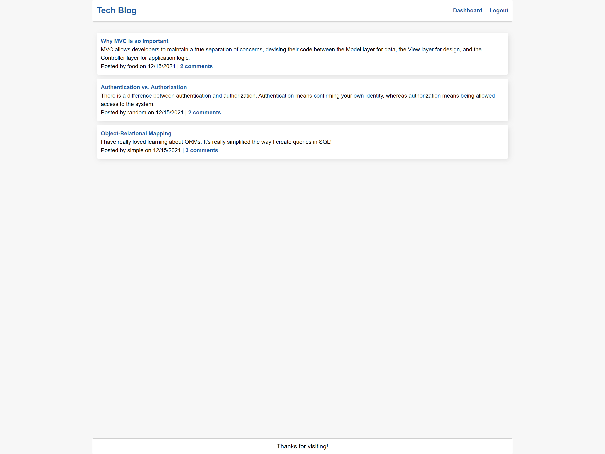

# Tech Blog


Built a CMS (Content Management System) style [blog site](https://salty-eyrie-03206.herokuapp.com/) where developers can publish their blog posts and comment on other developers' posts as well. Uses MVC (Model-View-Controller) paradigm, using `Handlebars.js` as template, `Sequelize` as ORM, and `Express-Session` npm (node package manager) for authentication.



## Table of Contents

* [Setup](#setup)
* [Usage](#usage)
* [Deployment](#deployment)
* [Contributing](#contributing)
* [License](#license)

## Setup
:floppy_disk:

Go to [Node's website](https://nodejs.org/en/) and follow the download instructions for your appropriate setup. NPM, or Node Package Manager, is the default package manager for Node.js. It is distributed with Node.js.

The database uses the following npm:
- [Node Package Manager](https://nodejs.org/en/)
  - Run `npm install` in order to install the following npm package dependencies as specified in the `package.json`.
  - This will also help install express on your system and manage any other dependencies in your script.
- [Dotenv](https://www.npmjs.com/package/dotenv)
  - Loads environment variables from a `.env` file into `process.env`. Sync .env files between machines, environments, and team members.
- [bcrypt](https://www.npmjs.com/package/bcrypt)
  - Library to help hash passwords.

Uses MySQL and MySQL2 tools for this application:

- [MySQL](https://www.mysql.com/)
  - Considered the most reliable, scaleable, and developer-friendly open source relational dtabase management system. It powers the back end of many popular social, streaming, and service web applications.
- [MySQL2](https://www.npmjs.com/package/mysql2)
  - An npm package for Node.js with a focus on performance. Connects Node.js applications to the MySQL database.
- [Sequelize](https://sequelize.org/)
  - Promise-based Node.js ORM for Postgres, MySQL, MariaDB, SQLite and Microsoft SQL Server. Features solid transaction support, relations, eager and lazy loading, read replication and more.
- [Handlebars](https://www.npmjs.com/package/handlebars)
  - Logicless templating languages that keep the view and the code separated.
- [Express](https://www.npmjs.com/package/express)
  - A minimal and flexible Node.js web application framework that provides a robust set of features to develop web and mobile applications. Facilitates the rapid development of Node based Web applications.
- [Express Handlebars](https://www.npmjs.com/package/express-handlebars)
  - Logicless templating language that keeps the View and the code separate and compiles templates into JavaScript functions. An extension to the Mustache templating language.
- [Express-Session](https://www.npmjs.com/package/express-session)
  - Express.js middleware that uses sessions, mechanism that helps applications to determine whether multiple requests came form the same client. Developers may assign every user a unique session so that their application can store the user state, and thus authenticate users.
- [Connect Session Store using Sequelize](https://www.npmjs.com/package/connect-session-sequelize)
  - Provides applications with a scalable store for sessions. The express-session package's default server-side session storage, `MemoryStore`, is purposely not designed for a production environment, will leak memory under most conditions, doesn't scale past a single process, and is only meant for debugging and developing. The connect-session-sequelize package resolves these issues and is compatible with the Sequelize ORM.

This repository uses the following server:

- [Heroku](https://heroku.com/)
  - A cloud application platform service that enables developers to build, run and operate applications entirely in the cloud.
- [JawsDB Add-On](https://elements.heroku.com/addons/jawsdb)
  - Uses JawsDB MySQL, a Heroku add-on, that provides a fully functional MySQL database server for use with Heroku application.

`npm init`

`npm i dotenv`

`npm i bcrypt`

`npm i mysql2`

`npm i handlebars`

`npm i express`

`npm i express-handlebars`

`npm i express-session`

`npm i connect-session-sequelize`

`heroku create`

`git push heroku main`

`heroku run node seeds/index.js`

If you cloned or copied the repository, ensure that you create an .env file in your local repository with similar text below:
```js
DB_NAME='techblog_db'
DB_USER='your-username' // typically root
DB_PW='your-password'
```

Seed your database by typing `node seeds/index.js` in the command line. Feel free to change the seeds data as desired.

## Usage

:computer:

Go to [Tech Blog](https://salty-eyrie-03206.herokuapp.com/) and navigate through seeded articles and links. Log in to be able to post and comment on the blog.

User is able to:
- Create a new account to post their own blog and comment.
- Edit, comment and delete their own posts.
- View and comment on other submitted posts.

## Deployment

[Deployed link to Tech Blog](https://salty-eyrie-03206.herokuapp.com/)

## Contributing

:octocat:

[paperpatch](https://github.com/paperpatch)

## License

:receipt:

This project is licensed under MIT.